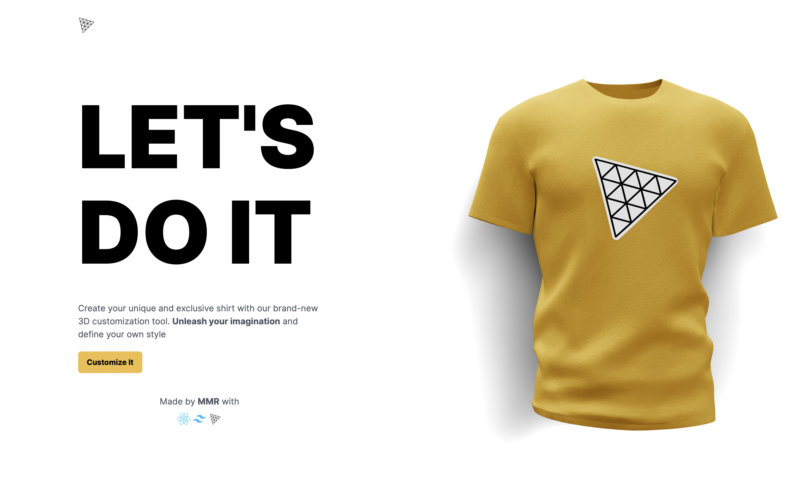

### Custom T-Shirt Design Platform

Welcome to the future of custom t-shirt design, where your imagination knows no bounds. Our mission is to empower you to transform your wardrobe with unique creations. With the mantra "Design Beyond Limits," we are dedicated to providing an intuitive and enriching t-shirt design experience.

---

#### About

The custom t-shirt design platform is developed and maintained by [Md Musfikur Rahman](https://musfikur.com). We are passionate about revolutionizing the fashion industry and empowering individuals to unleash their creativity through personalized design. Join us on this journey to redefine the future of custom apparel.

---

#### Features

- **Custom Design Creation**: Users can create custom t-shirt designs using a variety of tools and resources.
- **Extensive Design Options**: Access a wide range of design elements, including graphics, text, colors, and patterns.
- **Real-time Preview**: View a real-time preview of the design as it evolves, allowing for instant feedback and adjustments.
- **Three.js Integration**: Incorporate Three.js for 3D rendering capabilities, enabling users to visualize designs from different angles.
- **Framer Motion Animations**: Enhance the user interface with fluid animations and transitions using Framer Motion.
- **AI-Powered Suggestions**: Leverage AI to provide design suggestions and inspirations based on user preferences and trends.
- **Responsive Design**: The platform is designed to be responsive, ensuring seamless access across various devices and screen sizes.

---

#### Technology Stack

- **Frontend**:
  - React: A JavaScript library for building user interfaces.
  - Tailwind CSS: A utility-first CSS framework for rapid UI development.
  - Three.js: A JavaScript library for 3D graphics rendering.
  - Framer Motion: A React library for creating animations and gestures.
- **Backend**: Rapid API

---

#### Mission Statement

At our custom t-shirt design platform, we believe in unleashing creativity without limits. Our goal is to empower individuals to express themselves through personalized fashion, pushing the boundaries of design innovation and individuality. With cutting-edge technology and a passion for creativity, we strive to redefine the future of custom apparel.

---

#### Deployment

The custom t-shirt design platform is deployed on Vercel, ensuring reliable hosting and accessibility. The deployment process is automated and streamlined, allowing for quick updates and optimizations.

**Live Link**: [Custom T-Shirt Design Platform Demo](https://tshirt-design.vercel.app)

To deploy the custom t-shirt design platform:
1. Clone the repository from GitHub.
2. Install dependencies using npm or yarn.
3. Configure environment variables as necessary.
4. Connect the project to the deployment platform and deploy using the provided tools or scripts.
5. Monitor the deployment status and access the live application URL.

---

#### Contributing

Contributions to the custom t-shirt design platform are welcome! Whether you want to suggest new features, report bugs, or submit code improvements, please follow these guidelines:
- Fork the repository and create a new branch for your changes.
- Commit your changes with descriptive messages.
- Open a pull request, explaining the purpose and impact of your changes.
- Participate in discussions and address feedback to ensure the quality of contributions.

---

#### Contact

For inquiries, feedback, or support, please contact the project maintainer(s) at [contact@musfikur.com](mailto:contact@musfikur.com).

---

**Screenshot**:

